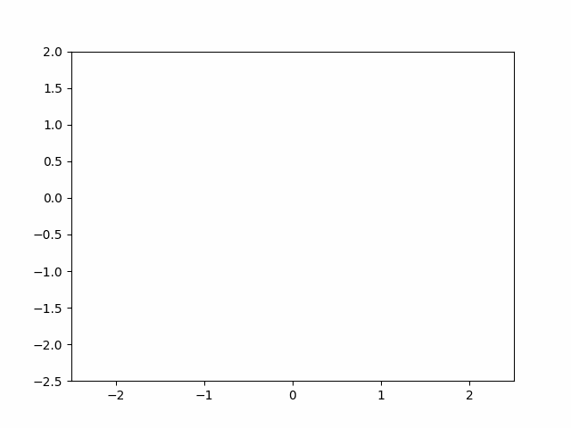

# Double Pendulum Simulation

This project simulates the motion of multiple double pendulums with varying initial conditions. The simulation is visualized using an animation that demonstrates the chaotic behavior of the pendulums over time.

<p float="left">
  
   
</p>


## Requirements

- Python 3.x
- NumPy
- Matplotlib
- SciPy

## Installation

To install the required packages, you can use pip:

```sh
pip install numpy matplotlib scipy
